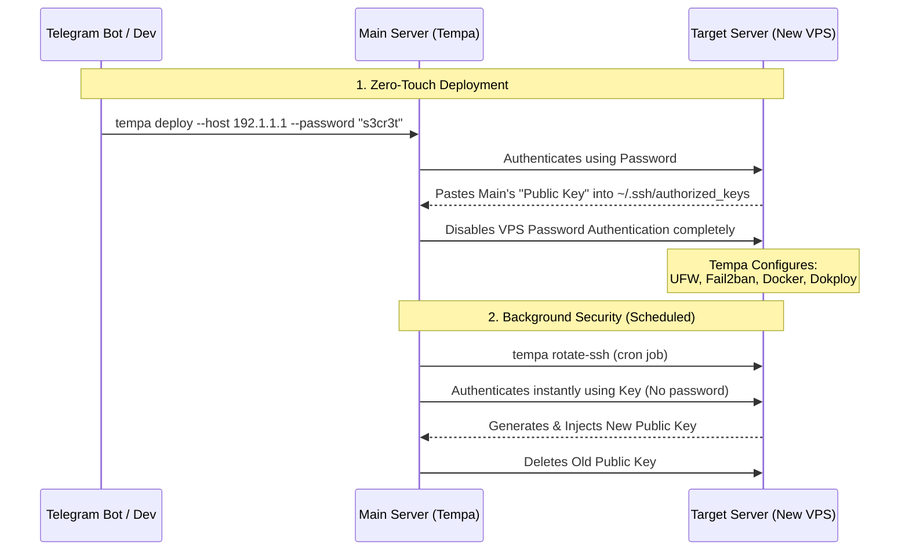

# 🚀 Tempa

**Tempa** is an opinionated, simple, automation-ready tool to bootstrap a blank VPS into a production-ready server using Ansible.

Focus:
- Simplicity > flexibility
- Fast, opinionated setups
- CLI / Telegram / CI automation ready

---

## 🧱 What's Included (MVP)

- **Base Utilities**: `curl`, `wget`, `unzip`, `htop`, `nano`, & optional `git`
- **Security**: UFW Firewall, Fail2ban (SSH protection), and a 1GB Swap file
- **Docker Engines**: 
  - Mode 1: Native Docker + Caddy (Reverse proxy with auto-HTTPS)
  - Mode 2: Dokploy (PaaS with built-in Traefik)
- **Optional Services**: Umami analytics

---

## 🛠️ Prerequisites

1. **Target VPS**: A fresh server (e.g., Ubuntu 20.04/22.04 LTS).
   > **⚠️ WARNING FOR LOCAL TESTING:** Tempa is highly opinionated and makes system-level changes (configures UFW, formats a 1GB Swapfile, installs Docker, and enables Fail2ban). **Do not run this on your personal local machine** unless you are using an empty virtual machine or are prepared to manually clean up/remove these changes afterwards!
2. **SSH Key Access**: You must be able to SSH into your root or sudo user without a password.
   ```bash
   ssh-copy-id ubuntu@YOUR_SERVER_IP
   ```

---

## 🚀 Quick Start

1. **Install Tempa Globally:**
   Just run this one-liner setup script on your Main Server (it clones the repo, installs Ansible, and sets your PATH safely):
   ```bash
   curl -sSL https://raw.githubusercontent.com/irsyaadbp/tempa/main/install.sh | bash
   ```

2. **Reload your shell:**
   ```bash
   source ~/.zshrc  # or ~/.bashrc
   ```

3. **Configure Inventory (Optional):**
   Create an `ansible/inventory.ini` on your Main Server and add your Target Server's IP address.

4. **Deploy (Interactive Mode):**
   ```bash
   tempa deploy
   ```
   *Tempa will automatically ask you for the target server's IP address!*

---

## ⚙️ Deployment Modes

### 1. Interactive Mode
Run `tempa deploy`. Ansible will prompt you for configuration choices (y/n, Docker mode, etc.). Defaults are provided.

### 2. Preset Mode
Want to skip prompts? Use a pre-defined YAML configuration file from the `presets/` directory.

**Available Presets:**
- `minimal` — Installs Docker & UFW. Skips Git, Swap, Fail2ban, and Umami. Best for tiny staging VPS.
- `production` — Focuses on security and stability. Installs Git, Docker, UFW, Swap, and Fail2ban. Skips Umami.
- `full` — The ultimate setup. Includes everything in `production` + automatically deploys a Umami/Postgres analytics stack.

```bash
tempa deploy --preset production
```

### 3. Non-Interactive Mode (CLI Extra Vars)
Perfect for CI or automation. Pass variables directly:

```bash
tempa deploy --host 203.0.113.1 -e "install_git=y ssh_port=2222 docker_mode=2"
```

### 4. Dynamic Host Overrides (No Inventory Needed)
Using the CLI, you can bypass the `inventory.ini` entirely and strictly provide an IP dynamically:

```bash
# Setup a single fresh VPS instantly:
tempa deploy --host 203.0.113.1

# Login using a specific SSH user instead of root:
tempa deploy --host 203.0.113.1 --user ubuntu
```

---

## 🏗️ Architecture & SSH Credential Flow

Tempa uses an **Agentless Architecture**. This means `tempa` and `ansible` are only installed on your **Main Server** (Control Node). The **Target Servers** (VPS) remain completely clean and only receive commands via SSH.

Here is the exact flow of how the Main Server authenticates and configures a brand new Target Server:



---

## 🔐 SSH Security & Rotation

Tempa is designed with a "Security First" mindset, focusing on protecting your VPS from day one.

### 1. Zero-Touch Provisioning

You can set up a brand new VPS without ever manually configuring SSH keys. Tempa will handle it in one step:

```bash
tempa deploy --host 192.1.1.1 --password "your_vps_initial_password"
```

**What happens under the hood:**
- Tempa connects using the password (via `sshpass`).
- It automatically generates a secure SSH key locally if you don't have one.
- It pushes your Public Key to the VPS.
- **Critical Security:** It immediately disables password authentication on the VPS.
- All future connections use your secure SSH key.

### 2. Self-Provisioning (Main Server)

If you want the **Main Server** (the one running Tempa) to also have Dokploy and other tools installed, Tempa can simply "aim at itself" using the `--self` flag.

```bash
tempa deploy --self
```

This uses `ansible_connection=local`, meaning it doesn't need SSH keys or passwords to talk to itself—it just gets to work immediately.

### 3. Automated SSH Rotation (`rotate-ssh`)

To stay secure, you should rotate your SSH keys periodically. Tempa makes this trivial.

**Manual Rotation:**
```bash
tempa rotate-ssh --host 192.1.1.1
```

**Scheduled Rotation (Cron):**
Set it and forget it! This command adds a Cron job to your Main Server to rotate keys automatically.

```bash
# Rotate keys every week
tempa rotate-ssh --interval 1w --host 192.1.1.1
```

**How rotation works safely:**
1. Generates a brand new keypair in `~/.ssh/tempa_keys/`.
2. Connects using the *current* key.
3. Injects the *new* key into the VPS.
4. Verifies the connection with the *new* key works.
5. Only after verification, it removes the *old* key and updates your local `~/.ssh/id_ed25519`.

---

## 🌐 Managing Multiple Servers

Ansible is perfectly designed for managing multiple servers at once. You can list as many VPS IPs as you want under the `[production]` group in your `ansible/inventory.ini`.

```ini
[production]
web-api-1 ansible_host=203.0.113.1
web-api-2 ansible_host=203.0.113.2
database-1 ansible_host=203.0.113.3

[staging]
staging-server ansible_host=203.0.113.8
```

By default, running `tempa deploy` attempts to configure **all** servers in the file, running actions on them simultaneously in parallel.

### Targeting Specific Servers (`--target`)

If you want to deploy to only a specific group (or a specific single server), use the `--target` flag:

**Format the entire production cluster:**
```bash
tempa deploy --target production
```

**Format ONLY the `web-api-2` server (leaving the rest alone):**
```bash
tempa deploy --target web-api-2
```

---

## 🔒 Post-Deployment Security Note

For Umami deployments, remember to change the default `admin / umami` credentials immediately upon first login. If running the `full.yml` preset, make sure to override the plaintext `umami_db_password` with a secure approach (e.g., Ansible Vault) in a production setup.
